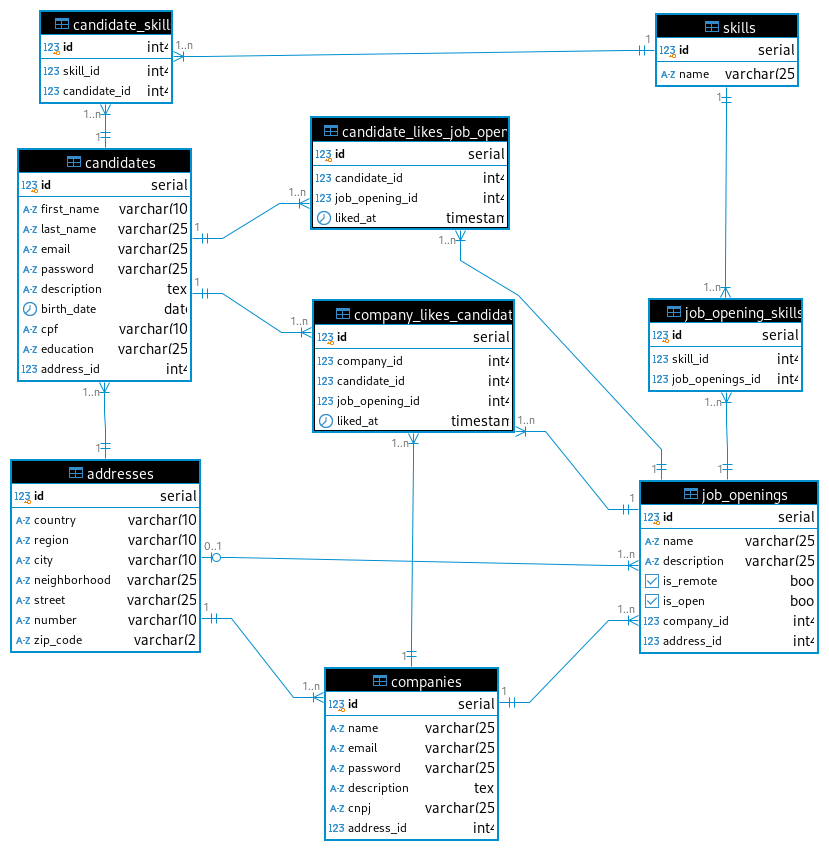

# Simple console App with Groovy

A new app that will help jobseekers and companies find the perfect match. Candidates can pick the jobs they're most interested in, and companies can see which applicants are the best fit. It's all done in an objective way, and no one knows who's who until there's a match.

by Gustavo de Araújo Garcia

### Requirements:
1. Java 21
2. Groovy 4.0.22
3. Gradle 8.10
4. Postgresql
5. Tomcat 11.0.1

### How to execute the Backend

#### 01 - From the Backend folder type in Bash:

```gradle cleanBuild```

    You need to have the Postgresql database running on your machine.
    You need to have an server, like Tomcat, running on your machine.

For now, you can copy the ROOT.war file to the webapps folder of your Tomcat server (this is a temporary solution, I'm
working on a better way to deploy the application). \
Init the Tomcat server and access the URL: http://localhost:8080/

Endpoints:

POST /candidates \
POST /companies \
POST /job-openings \
POST /addresses \
POST /skills \

For learning purposes,I am using Jakarta Servlets to create the endpoints. \
The file src/main/webapp/WEB-INF/web.xml is the configuration file for the servlets. \
I mapped the endpoints with annotations, reason why the web.xml file is empty.
The project is still in early stages of development, so be aware that there are still many things to be done.

### How to execute the Frontend
#### 02 - From the Frontend folder type in Bash:
```npm run serve```

## Design of Database


Created with DBeaver

This project uses Postgresql to store its data.